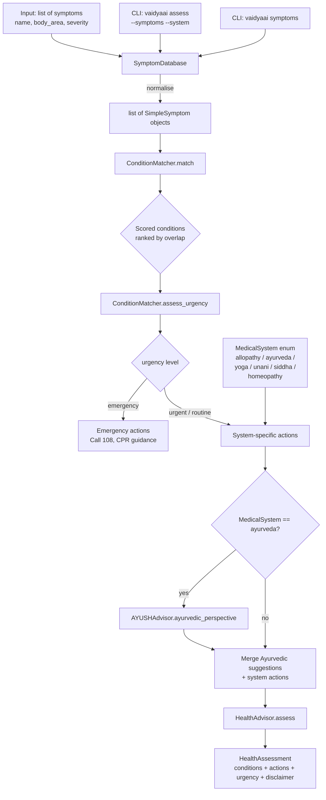

# aumai-vaidyaai

> Health assistant combining AYUSH and allopathy for rural India.
> Part of the [AumAI](https://github.com/aumai) open source agentic AI ecosystem.

[](https://github.com/aumai/aumai-vaidyaai/actions)
[](https://pypi.org/project/aumai-vaidyaai/)
[](LICENSE)
[](https://python.org)

---

> **MANDATORY MEDICAL DISCLAIMER**
>
> This tool does NOT provide medical advice, diagnosis, or treatment.
> Symptom analysis is based on keyword matching only and may be significantly
> inaccurate. All outputs must be reviewed by a qualified healthcare professional
> before any medical action is taken. In emergencies, contact your nearest hospital
> or dial 108 (India Emergency Ambulance) immediately. This tool is NOT a substitute
> for clinical consultation with a registered physician.
>
> This is an India Sovereign Domain project. Designed for use by trained rural
> health workers (ASHAs, ANMs, CHOs) and health informaticists — not for direct
> patient self-diagnosis.

---

## What is aumai-vaidyaai?

India's healthcare reality is shaped by geography. Over 65% of the population
lives in rural areas, but less than 30% of doctors practise there. A community
health worker (ASHA or ANM) in a remote taluka may be the first — and sometimes
only — healthcare contact for thousands of residents.

When a patient presents with fever, joint pain, and rash, the health worker needs
help thinking through the differential: Is this dengue? Chikungunya? Typhoid? And
critically, does this patient need immediate referral to a Primary Health Centre
(PHC), or can it be managed at the community level?

**aumai-vaidyaai** is a structured decision-support toolkit that:

1. Takes a list of symptoms as input
2. Matches them against a rule-based condition catalogue covering 20 conditions
   including emergencies (stroke, anaphylaxis, acute coronary syndrome)
3. Assigns a likelihood estimate (keyword-based, not probabilistic) and urgency
   tier to each matched condition
4. Generates recommended next actions from the perspective of any of India's
   recognised medical systems: allopathy, Ayurveda, Yoga, Unani, Siddha, or
   Homeopathy (the six systems under AYUSH)
5. Surfaces Ayurvedic general wellness perspectives for relevant symptoms

It is designed to be embedded in rural health worker applications, telemedicine
triage flows, and digital health education tools.

## Why does this matter?

India's AYUSH framework recognises five traditional medicine systems alongside
allopathy. In rural areas, Ayurvedic practitioners and registered Unani Hakeems
are often more accessible than allopathic doctors. A health tool that speaks only
the language of allopathy is not useful in these contexts.

aumai-vaidyaai bridges this gap by providing parallel recommendation pathways:
the same symptom set can yield allopathic referral guidance (CBC, Widal test),
Ayurvedic wellness context (Giloy kadha, Triphala), and a consistent emergency
triage layer that overrides all systems when life-threatening conditions are
matched.

## Architecture



## Features

- **20 condition catalogue** — covers common, urgent, and emergency conditions
  including dengue, malaria, typhoid, pneumonia, tuberculosis, stroke, acute
  coronary syndrome, anaphylaxis, appendicitis, uncontrolled diabetes, and more
- **ICD-10 coded conditions** — every matched condition carries its ICD-10 code
- **Six medical system perspectives** — allopathy, Ayurveda, Yoga, Unani, Siddha,
  and Homeopathy via the `MedicalSystem` enum
- **Emergency triage override** — when any matched condition is `urgency=emergency`,
  the response always includes "Call 108 immediately" actions regardless of system
- **Ayurvedic wellness context** — `AYUSHAdvisor` maps symptoms to traditional
  Ayurvedic remedy suggestions (herbs, dietary advice, lifestyle practices)
- **Likelihood scoring** — conditions are ranked by overlap percentage between
  reported symptoms and condition's known symptom list
- **Body area mapping** — 100+ symptoms mapped to body areas (head, chest, abdomen,
  skin, urinary, musculoskeletal, general)
- **Symptom normalisation** — `SymptomDatabase.normalise` converts raw string input
  to structured `SimpleSymptom` objects
- **Mandatory disclaimers** — all assessments and all CLI output embed the
  AYUSH + allopathy disclaimer; non-removable by design

## Quick Start

```bash
pip install aumai-vaidyaai
```

### Assess symptoms from the CLI

```bash
# Allopathy perspective
vaidyaai assess --symptoms "fever,headache,body ache,chills" --system allopathy

# Ayurveda perspective
vaidyaai assess --symptoms "fever,cough,fatigue" --system ayurveda

# Emergency symptoms
vaidyaai assess --symptoms "chest pain,left arm pain,breathlessness,sweating"
```

### List all known symptoms

```bash
vaidyaai symptoms
```

## CLI Reference

### `vaidyaai assess`

Assess a comma-separated list of symptoms and generate health recommendations.
Underscores in symptom names are replaced with spaces automatically.

```
Usage: vaidyaai assess [OPTIONS]

Options:
  --symptoms TEXT  Comma-separated symptom names  [required]
                   Example: "fever,headache,body_ache,chills"
  --system TEXT    Medical system for recommendations  [default: allopathy]
                   Choices: allopathy, ayurveda, yoga, unani, siddha, homeopathy
  --help           Show this message and exit.
```

**Example — routine assessment:**

```bash
vaidyaai assess --symptoms "runny nose,sneezing,sore throat,mild fever" --system allopathy
```

```
============================================================
HEALTH ASSESSMENT (ALLOPATHY PERSPECTIVE)
============================================================

URGENCY LEVEL: ROUTINE

SYMPTOMS ASSESSED:
  - runny nose (head, mild)
  - sneezing (head, mild)
  - sore throat (head, mild)
  - mild fever (general, mild)

POSSIBLE CONDITIONS:
  - Common Cold [ICD: J06.9]
    Likelihood: 80% (keyword-based estimate only)
    Viral upper respiratory tract infection, usually self-limiting in 7-10 days.

RECOMMENDED ACTIONS:
  - Consult a qualified MBBS/MD physician for diagnosis and treatment.
  - A complete blood count (CBC) and relevant investigations are advised.
  - Take prescribed medications as directed. Do not self-medicate.

DISCLAIMER: IMPORTANT MEDICAL DISCLAIMER...
```

**Example — emergency symptoms:**

```bash
vaidyaai assess --symptoms "chest pain,left arm pain,sweating,breathlessness,nausea"
```

```
URGENCY LEVEL: EMERGENCY
*** SEEK EMERGENCY MEDICAL CARE IMMEDIATELY ***

POSSIBLE CONDITIONS:
  - Acute Coronary Syndrome [ICD: I24]
    Likelihood: 60%
    EMERGENCY: Possible heart attack. Call 108 immediately.

RECOMMENDED ACTIONS:
  - CALL 108 (Ambulance) IMMEDIATELY.
  - Do not drive yourself to hospital if experiencing chest pain...
```

**Example — Ayurveda perspective:**

```bash
vaidyaai assess --symptoms "fever,cough,headache" --system ayurveda
```

---

### `vaidyaai symptoms`

List all 100+ known symptoms in the database, sorted alphabetically with index
numbers.

```
Usage: vaidyaai symptoms [OPTIONS]

Options:
  --help  Show this message and exit.
```

---

### `vaidyaai serve`

Start the VaidyaAI REST API server. Requires `uvicorn` to be installed.

```
Usage: vaidyaai serve [OPTIONS]

Options:
  --port INTEGER  Port  [default: 8000]
  --host TEXT     Host  [default: 127.0.0.1]
  --help          Show this message and exit.
```

Note: The `aumai_vaidyaai.api` module is not yet implemented in v0.1.0.

---

## Python API Examples

### Basic symptom assessment

```python
from aumai_vaidyaai.core import HealthAdvisor, SymptomDatabase
from aumai_vaidyaai.models import MedicalSystem, SimpleSymptom

db = SymptomDatabase()
advisor = HealthAdvisor()

# Create symptom objects
symptoms = [
    db.normalise("high fever"),
    db.normalise("severe headache"),
    db.normalise("eye pain"),
    db.normalise("joint pain"),
    db.normalise("rash"),
]

assessment = advisor.assess(symptoms, MedicalSystem.allopathy)

print(f"Urgency: {assessment.urgency}")
for condition in assessment.possible_conditions[:3]:
    print(f"  {condition['name']} ({condition['icd_code']}): {condition['likelihood_pct']}%")
    print(f"  -> {condition['description']}")
```

### Ayurveda perspective with wellness suggestions

```python
from aumai_vaidyaai.core import AYUSHAdvisor, HealthAdvisor, SymptomDatabase
from aumai_vaidyaai.models import MedicalSystem

db = SymptomDatabase()
advisor = HealthAdvisor()
ayush = AYUSHAdvisor()

symptoms = [db.normalise(s) for s in ["fever", "cough", "fatigue"]]

# Full assessment from Ayurveda perspective
assessment = advisor.assess(symptoms, MedicalSystem.ayurveda)
print("Ayurveda recommended actions:")
for action in assessment.recommended_actions:
    print(f"  - {action}")

# Ayurvedic perspective only, without condition matching
suggestions = ayush.ayurvedic_perspective(symptoms)
print("\nAyurvedic general wellness context:")
for s in suggestions:
    print(f"  - {s}")
```

### Emergency triage

```python
from aumai_vaidyaai.core import HealthAdvisor, SymptomDatabase
from aumai_vaidyaai.models import MedicalSystem

db = SymptomDatabase()
advisor = HealthAdvisor()

# FAST stroke symptoms
symptoms = [
    db.normalise("face drooping"),
    db.normalise("arm weakness"),
    db.normalise("speech difficulty"),
    db.normalise("sudden headache"),
]

assessment = advisor.assess(symptoms, MedicalSystem.allopathy)

if assessment.urgency == "emergency":
    print("EMERGENCY — immediate action required:")
    for action in assessment.recommended_actions:
        print(f"  {action}")
```

### Using `ConditionMatcher` directly

```python
from aumai_vaidyaai.core import ConditionMatcher, SymptomDatabase

db = SymptomDatabase()
matcher = ConditionMatcher()

symptoms = [
    db.normalise("persistent cough"),
    db.normalise("weight loss"),
    db.normalise("night sweats"),
    db.normalise("fever"),
    db.normalise("fatigue"),
]

conditions = matcher.match(symptoms)
print(f"Matched {len(conditions)} conditions:")
for c in conditions:
    print(f"  {c['name']}: {c['likelihood_pct']}% — {c['urgency']}")
    print(f"  Matched symptoms: {c['matched_symptoms']}")

urgency = matcher.assess_urgency(conditions)
print(f"\nHighest urgency level: {urgency}")
```

### Multi-system comparison

```python
from aumai_vaidyaai.core import HealthAdvisor, SymptomDatabase
from aumai_vaidyaai.models import MedicalSystem

db = SymptomDatabase()
advisor = HealthAdvisor()
symptoms = [db.normalise(s) for s in ["joint pain", "fatigue", "fever"]]

for system in MedicalSystem:
    assessment = advisor.assess(symptoms, system)
    print(f"\n--- {system.value.upper()} ---")
    for action in assessment.recommended_actions[:2]:
        print(f"  {action}")
```

### Normalising raw symptom strings

```python
from aumai_vaidyaai.core import SymptomDatabase

db = SymptomDatabase()

# Normalise returns a SimpleSymptom with body area classification
symptom = db.normalise("chest pain")
print(symptom.name)        # "chest pain"
print(symptom.body_area)   # "chest"
print(symptom.severity)    # "mild" (default)

symptom = db.normalise("severe headache")
print(symptom.body_area)   # "head"

# List all known symptom names
all_symptoms = db.all_symptom_names()
print(f"Known symptoms: {len(all_symptoms)}")
```

## Configuration

aumai-vaidyaai uses hardcoded rule-based matching. There are no external model
weights, API keys, or configuration files required. Key internal data structures:

| Data structure          | Location   | Purpose                                           |
|-------------------------|------------|---------------------------------------------------|
| `_CONDITIONS`           | `core.py`  | 20-condition catalogue with symptom lists, ICD codes, urgency |
| `_SYMPTOM_BODY_AREAS`   | `core.py`  | 100+ symptom → body area mappings                 |
| `_AYURVEDIC_MAPPINGS`   | `core.py`  | Symptom key → list of Ayurvedic wellness suggestions |
| `_SYSTEM_ACTIONS`       | `core.py`  | `MedicalSystem` → list of recommended action strings |
| `_EMERGENCY_ACTIONS`    | `core.py`  | Hardcoded emergency action strings (always included for emergency urgency) |

## How It Works — Deep Dive

### Symptom Normalisation

`SymptomDatabase.normalise(name)` strips whitespace, lowercases the name, and
looks up the body area in `_SYMPTOM_BODY_AREAS`. The default severity is always
`"mild"`. The resulting `SimpleSymptom` object is what `ConditionMatcher` operates
on.

### Condition Matching

`ConditionMatcher.match` computes the set intersection of reported symptom names
with each condition's `matching_symptoms` list. If the overlap count meets the
condition's `min_match` threshold, the condition is included with a likelihood
score:

```
likelihood_pct = min(round(overlap / len(condition_symptoms) * 100), 95)
```

The cap at 95% reflects the fundamental limitation: this is keyword matching, not
clinical diagnosis. The `likelihood_note` field on every matched condition makes
this explicit: `"Estimated by keyword matching only — not a clinical probability."`.

Results are sorted descending by likelihood. Conditions are never excluded from
the results based on missing symptoms — only on insufficient overlap.

### Urgency Assessment

`assess_urgency` scans matched conditions in order. Any `emergency`-urgency
condition immediately returns `"emergency"`. Then `"urgent"` conditions are checked.
Only if none are found does it return `"routine"`. This is a conservative,
safety-first priority ordering.

### AYUSH Advisor

`AYUSHAdvisor.ayurvedic_perspective` maps each symptom's name to keys in
`_AYURVEDIC_MAPPINGS` using substring matching. Matched suggestions are deduplicated.
If no matches are found, general wellness suggestions are returned as a fallback.
Every response ends with a reminder to consult a registered BAMS physician.

The `HealthAdvisor.assess` method merges Ayurvedic suggestions with system-level
action strings for the Ayurveda system, deduplicated while preserving order.

### Emergency Override

When urgency is `"emergency"`, `_EMERGENCY_ACTIONS` is prepended to the recommended
actions before system-specific actions. This ensures that regardless of which
medical system is selected, the "Call 108 immediately" instruction is always first.

## Integration with Other AumAI Projects

| AumAI project      | Integration point                                                    |
|--------------------|----------------------------------------------------------------------|
| aumai-healthpulse  | Condition `icd_code` fields are aligned with the healthpulse disease registry for cross-project ICD-10 consistency |
| aumai-specs        | `HealthAssessment`, `SimpleSymptom`, and `MedicalSystem` models can be validated against AumAI spec schemas |
| aumai-audittrail   | Assessment results can be logged as structured audit events          |

## Contributing

See [CONTRIBUTING.md](CONTRIBUTING.md). All contributions must:

1. Pass `ruff check` and `mypy --strict` with zero errors
2. Include tests for any new condition, symptom mapping, or AYUSH suggestion
3. Use conventional commits: `feat:`, `fix:`, `refactor:`, `docs:`, `test:`, `chore:`
4. Never remove or weaken the mandatory medical disclaimer output
5. New conditions added to `_CONDITIONS` must include: `name`, `matching_symptoms`,
   `min_match`, `description`, `urgency`, and `icd_code`
6. Urgency must be one of: `"routine"`, `"urgent"`, `"emergency"`

## License

Apache License 2.0. See [LICENSE](LICENSE).

Copyright 2024 AumAI Contributors.

---

*aumai-vaidyaai is part of the AumAI open source agentic AI infrastructure for
India Sovereign Domain applications. This tool is NOT a replacement for medical
professionals.*
